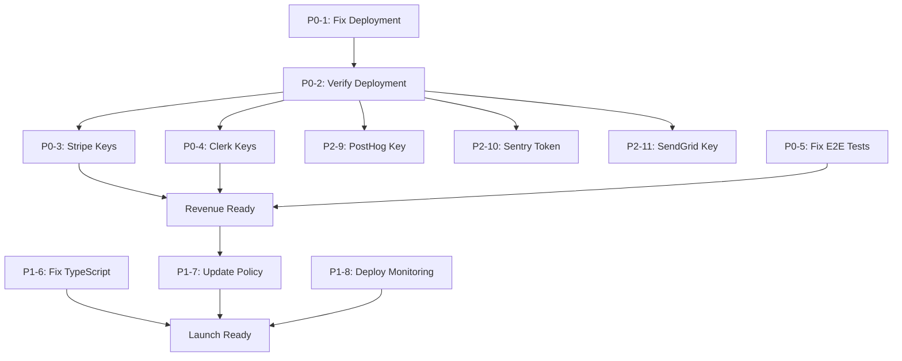

# SPRINT 20 - TASKS SUMMARY

**Created:** March 19, 2026
**Total Tasks:** 11
**Estimated Time:** 15-25 hours (2-3 business days)
**Critical Path:** P0 tasks → P1 tasks → P2 tasks

---

## P0-CRITICAL (Blocking Revenue - Must Fix First)

| ID | Task | Time | Deadline | Priority |
|----|------|------|----------|----------|
| cffb75f7 | Fix Vercel Deployment - Deploy Correct US-Canada Calculator App | 4-8 hrs | Mar 19, 22:00 PST | CRITICAL |
| 21d5c9e4 | Verify Correct App Deployed - Production Content Verification | 1 hr | Mar 19, 23:00 PST | CRITICAL |
| 86dd07e3 | Replace Stripe Production Keys - Revenue Blocker (16th Sprint) | 2 hrs | Mar 20, 01:00 PST | CRITICAL |
| 21a0825b | Replace Clerk Production Keys - Auth Blocker (Site 500 Errors) | 30 min | Mar 20, 02:00 PST | CRITICAL |
| 1ac1378a | Fix E2E Test Infrastructure - Playwright Server Won't Start (120s Timeout) | 2-4 hrs | Mar 20, 06:00 PST | CRITICAL |

**P0 Subtotal:** 9.5-15.5 hours

---

## P1-HIGH (Quality & Process - Fix Before Launch)

| ID | Task | Time | Deadline | Priority |
|----|------|------|----------|----------|
| 422ffe1c | Fix TypeScript Errors - 50+ Errors (Possibly Undefined, Unused Variables) | 4-6 hrs | Mar 21, 12:00 PST | HIGH |
| 181d5ea7 | Update Task Verification Policy - Require Production Content Checks | 1-2 hrs | Mar 20, 12:00 PST | HIGH |
| 756a0535 | Deploy Production Content Monitoring - Alert on Wrong App Detection | 1 hr | Mar 20, 18:00 PST | HIGH |

**P1 Subtotal:** 6-9 hours

---

## P2-MEDIUM (Post-Launch - After Deployment Fixed)

| ID | Task | Time | Deadline | Priority |
|----|------|------|----------|----------|
| 222ba1c4 | Replace PostHog Production Key - No Funnel Tracking | 15 min | Mar 21, 12:00 PST | MEDIUM |
| 74facc75 | Replace Sentry Auth Token - No Error Monitoring | 15 min | Mar 21, 12:00 PST | MEDIUM |
| 7a73ea2c | Replace SendGrid API Key - Email Drip Campaigns Blocked | 15 min | Mar 21, 12:00 PST | MEDIUM |

**P2 Subtotal:** 45 minutes

---

## CRITICAL PATH

```
HOUR 0-8:   [P0-1] Fix Vercel deployment configuration
HOUR 8-9:   [P0-2] Verify correct app deployed with content checks
HOUR 9-11:  [P0-3] Replace Stripe production keys + test payment
HOUR 11-12: [P0-4] Replace Clerk production keys + test signup
HOUR 12-16: [P0-5] Fix E2E test infrastructure

CHECKPOINT: All P0 tasks complete → Production ready for revenue

HOUR 16-22: [P1-6] Fix TypeScript errors (50+ errors)
HOUR 22-24: [P1-7] Update task verification policy
HOUR 24-25: [P1-8] Deploy production monitoring

CHECKPOINT: All P1 tasks complete → Ready for Product Hunt launch

HOUR 25-26: [P2-9,10,11] Replace PostHog, Sentry, SendGrid keys

FINAL: Launch Product Hunt
```

---

## DEPENDENCIES



---

## TASK DETAILS QUICK REFERENCE

### P0-1: Fix Vercel Deployment
**CRITICAL BLOCKER:** Wrong app deployed for 15+ sprints
- **Action:** Login to Vercel, check production branch setting, trigger redeploy
- **Evidence Required:** Production content check shows "H-1B" keyword, no "Nigeria" keyword
- **No localhost verification allowed**

### P0-2: Verify Correct App Deployed
**Validation Task**
- **Action:** Run 5 verification checks on production URL
- **Evidence Required:** Terminal output + 3 screenshots from production
- **Depends on:** P0-1 complete

### P0-3: Replace Stripe Production Keys
**REVENUE BLOCKER:** Cannot accept payments
- **Action:** Get live Stripe keys, update .env.production or Vercel dashboard
- **Evidence Required:** $1 test payment on production, screenshot of Stripe dashboard
- **Depends on:** P0-2 complete

### P0-4: Replace Clerk Production Keys
**AUTH BLOCKER:** Signup flow broken
- **Action:** Get Clerk production keys, update Vercel environment variables
- **Evidence Required:** Production signup works, screenshot of Clerk dashboard
- **Depends on:** P0-2 complete

### P0-5: Fix E2E Test Infrastructure
**TESTING BLOCKER:** Cannot verify production flows
- **Action:** Debug Playwright global-setup.ts, fix dev server race condition
- **Evidence Required:** All E2E tests pass, screenshot of Playwright results
- **Can run in parallel with P0-3, P0-4**

### P1-6: Fix TypeScript Errors
**CODE QUALITY:** 50+ errors (non-blocking)
- **Action:** Fix TS18048 (undefined), TS6133 (unused), TS4111, TS2532
- **Evidence Required:** tsc --noEmit shows 0 errors
- **Priority:** After P0s, before launch

### P1-7: Update Task Verification Policy
**PROCESS FIX:** Prevent recurrence of "done but not deployed" failures
- **Action:** Update docs/TASK_COMPLETION_POLICY.md with content verification requirements
- **Evidence Required:** Documentation updated, example script tested
- **Priority:** After P0s, before next sprint

### P1-8: Deploy Production Content Monitoring
**PREVENTION:** Detect wrong app deployment within 5 minutes
- **Action:** Set up UptimeRobot with keyword monitoring
- **Evidence Required:** Monitor active, test alert successful
- **Priority:** After P0s, before launch

### P2-9, P2-10, P2-11: Replace Remaining API Keys
**ANALYTICS & MONITORING:** PostHog, Sentry, SendGrid
- **Action:** Login to each service, get production keys, update Vercel
- **Evidence Required:** Screenshot of each dashboard showing events/activity
- **Priority:** After deployment fixed, before launch
- **Time:** 15 min each (45 min total)

---

## SUCCESS CRITERIA BY PHASE

### Phase 1: Deployment Fixed (4-8 hours)
- [ ] `curl https://taxbridge.vercel.app | grep "H-1B"` → Match found
- [ ] `curl https://taxbridge.vercel.app | grep "Nigeria"` → No match
- [ ] Calculator route works: /us-canada-tax-calculator returns HTTP 200
- [ ] Screenshot evidence from production (not localhost)

### Phase 2: Revenue Ready (4-6 hours)
- [ ] Stripe live keys configured in Vercel
- [ ] $1 test payment succeeds on production
- [ ] Clerk signup works on production
- [ ] E2E tests pass (4/4)

### Phase 3: Launch Ready (6-9 hours)
- [ ] TypeScript errors: 50+ → 0
- [ ] Task verification policy updated with content checks
- [ ] Production monitoring active (UptimeRobot or equivalent)
- [ ] PostHog, Sentry, SendGrid configured

### Phase 4: LAUNCH
- [ ] CEO manual QA pass on production
- [ ] Full smoke test passes
- [ ] Product Hunt submission ready

---

## RISK MITIGATION

### If Deployment Fix Takes Longer Than Expected (>8 hours)
**Contingency:** Create new Vercel project from scratch (Option B)
- **Time:** 2-4 hours
- **Pros:** Guaranteed clean slate
- **Cons:** Requires DNS update, more configuration

### If E2E Tests Cannot Be Fixed Quickly
**Contingency:** Skip E2E tests for Sprint 20, test manually
- **Manual testing:** CEO runs through calculator, signup, payment flow
- **Defer E2E fix to Sprint 21**

### If Stripe/Clerk Keys Require Business Verification
**Contingency:** Use test mode for Sprint 20 launch, upgrade to production in Sprint 21
- **Note:** This means NO real revenue in Sprint 20
- **Impact:** Product Hunt launch still possible, but payments in test mode

---

## LAUNCH READINESS CHECKLIST

**Can we launch Product Hunt after Sprint 20?**

### Must Have (Blocking)
- [ ] Correct app deployed to production (P0-1, P0-2)
- [ ] Stripe live payments work (P0-3)
- [ ] Clerk signup/login works (P0-4)
- [ ] Manual QA passes on production

### Should Have (Highly Recommended)
- [ ] E2E tests pass (P0-5)
- [ ] TypeScript errors fixed (P1-6)
- [ ] Production monitoring active (P1-8)

### Nice to Have (Post-Launch)
- [ ] PostHog tracking (P2-9)
- [ ] Sentry error monitoring (P2-10)
- [ ] SendGrid emails (P2-11)

**Minimum Time to Launch:** 12-16 hours (P0s + manual QA)
**Recommended Time to Launch:** 18-25 hours (P0s + P1s)

---

## FILES & DOCUMENTATION

**Audit Reports:**
- ✅ `docs/SPRINT_20_CEO_AUDIT.md` - Full technical audit
- ✅ `docs/SPRINT_20_EXECUTIVE_SUMMARY.md` - Executive quick reference
- ✅ `docs/SPRINT_20_TASKS_SUMMARY.md` - This file

**Task IDs:**
- P0-1: cffb75f7 (Fix Deployment)
- P0-2: 21d5c9e4 (Verify Deployment)
- P0-3: 86dd07e3 (Stripe Keys)
- P0-4: 21a0825b (Clerk Keys)
- P0-5: 1ac1378a (E2E Tests)
- P1-6: 422ffe1c (TypeScript)
- P1-7: 181d5ea7 (Verification Policy)
- P1-8: 756a0535 (Monitoring)
- P2-9: 222ba1c4 (PostHog)
- P2-10: 74facc75 (Sentry)
- P2-11: 7a73ea2c (SendGrid)

---

**Next Steps:**
1. CEO reviews executive summary and chooses deployment fix approach (Option A or B)
2. Engineer executes chosen approach
3. Engineer verifies with production content checks (no localhost)
4. Engineer proceeds through critical path
5. CEO conducts manual QA on production
6. Decision: Product Hunt launch readiness

**Status:** ✅ SPRINT 20 PLANNING COMPLETE - AWAITING EXECUTION
